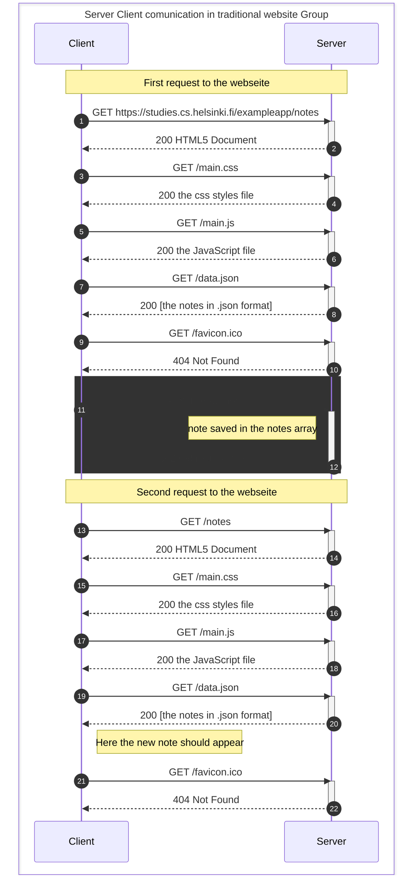
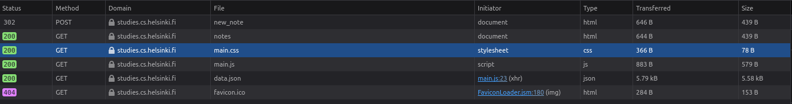

# Exercide 0.4
making a `HTTP` post to add a note

```mermaid
sequenceDiagram
	autonumber
	
    box Server Client comunication in traditional website Group
    	participant Client
    	participant Server
    end
	
    Note over Server, Client: First request to the webseite
    
	Client->> Server: GET https://studies.cs.helsinki.fi/exampleapp/notes
    activate Server
    Server-->> Client: 200 HTML5 Document
    deactivate Server
    
	Client->>Server: GET /main.css
    activate Server
    Server-->>Client: 200 the css styles file
    deactivate Server
    
    Client->>Server: GET /main.js
    activate Server
    Server-->>Client: 200 the JavaScript file
    deactivate Server
        
    Client->>Server: GET /data.json
    activate Server
    Server-->>Client: 200 [the notes in .json format]
    deactivate Server

	Client->> Server: GET /favicon.ico
    activate Server
    Server-->> Client: 404 Not Found
    deactivate Server

    rect rgba(50, 50, 50)
    	Client->> Server: POST /new_note
        activate Server
        
        note left of Server: note saved in the notes array
        
        Server-->> Client: 302 redirect to /notes
        deactivate Server
	end
    
	Note over Server, Client: Second request to the webseite

	Client->> Server: GET /notes
    activate Server
    Server-->> Client: 200 HTML5 Document
    deactivate Server
    
	Client->>Server: GET /main.css
    activate Server
    Server-->>Client: 200 the css styles file
    deactivate Server
    
    Client->>Server: GET /main.js
    activate Server
    Server-->>Client: 200 the JavaScript file
    deactivate Server
        
    Client->>Server: GET /data.json
    activate Server
    Server-->>Client: 200 [the notes in .json format]
    deactivate Server   
    note right of Client: Here the new note should appear

	Client->> Server: GET /favicon.ico
    activate Server
    Server-->> Client: 404 Not Found
    deactivate Server
    
```

 