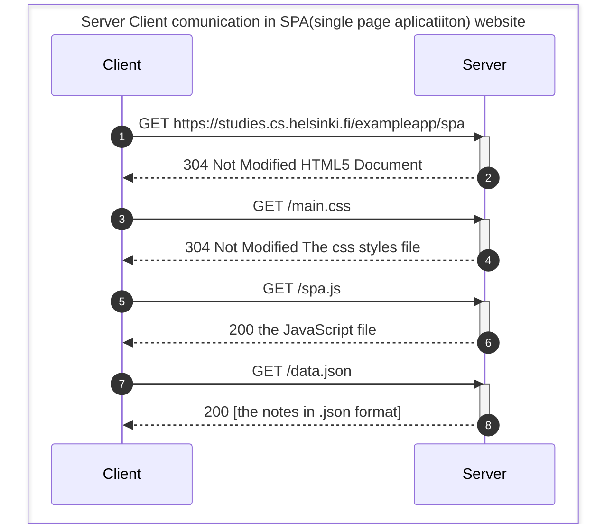
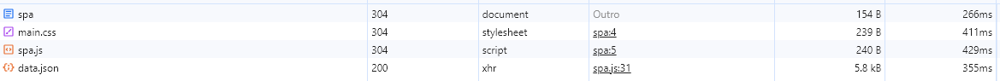

# 0.5: Single page app diagram

> Create a diagram depicting the situation where the user goes to the [single-page app](https://fullstackopen.com/en/part0/fundamentals_of_web_apps#single-page-app) version of the notes app at [https://studies.cs.helsinki.fi/exampleapp/spa](https://studies.cs.helsinki.fi/exampleapp/spa).

It's visible that _spa_ apps make less requests than the tradition form and it just make request to `.js` and `.css`, `.json` etc, but it does not make requests to more HTML5 documents, the main idea of _SPA_. 

