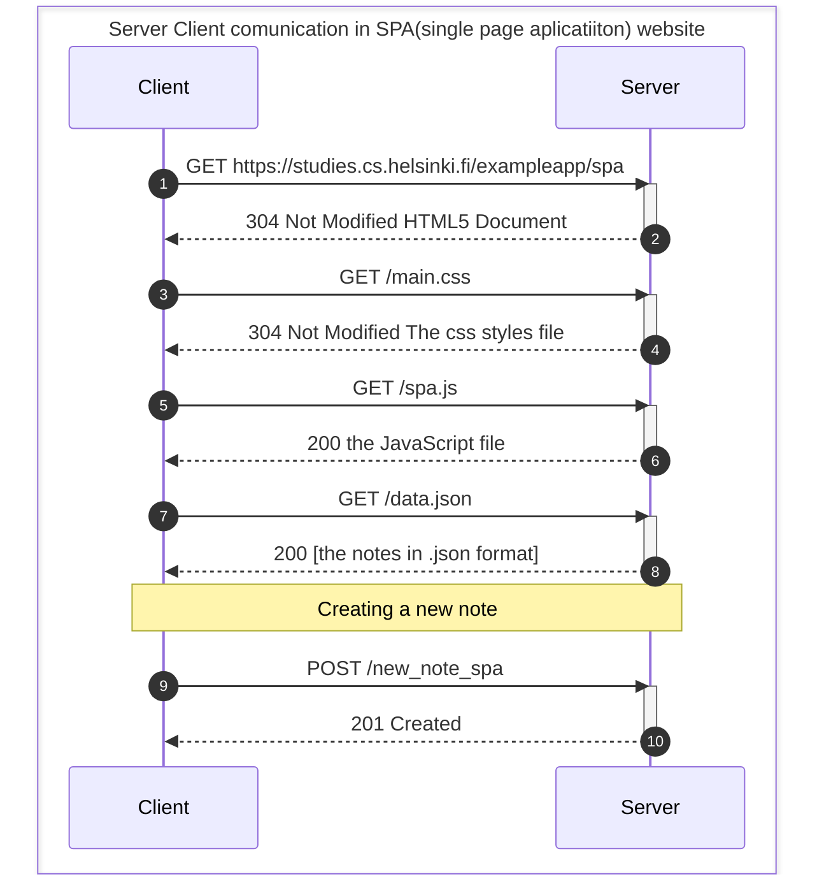
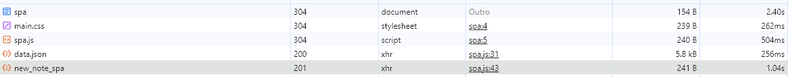

# 0.6: New note in Single page app diagram
> Create a diagram depicting the situation where the user creates a new note using the single-page version of the app.

_SPA_ apps just sent the AJAX request throw POST and the list was just re-redered, so no need for a new HTML5 Document.
In the console was printed `{"message":"note created"}` when the 201 returned.

